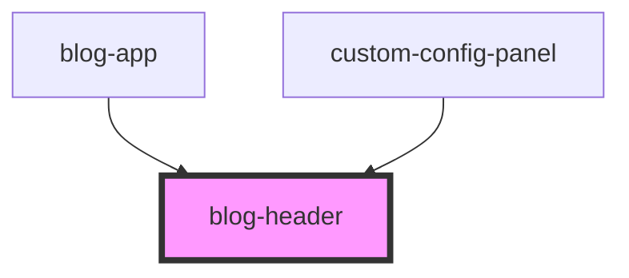

# blog-header

<!-- Auto Generated Below -->

## Properties

| Property          | Attribute          | Description | Type     | Default            |
| ----------------- | ------------------ | ----------- | -------- | ------------------ |
| `backgroundColor` | `background-color` |             | `string` | `"#e8eaf6"`        |
| `headerTitle`     | `header-title`     |             | `string` | `"Default Header"` |
| `subtitle`        | `subtitle`         |             | `string` | `undefined`        |

## Dependencies

### Used by

 - [blog-app](../blog-app)
 - [custom-config-panel](../custom-config-panel)

### Graph

----------------------------------------------

*Built with [StencilJS](https://stenciljs.com/)*
