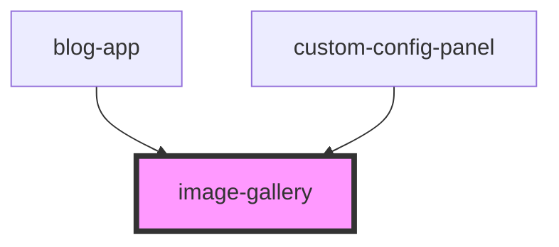

# image-gallery

<!-- Auto Generated Below -->

## Properties

| Property          | Attribute          | Description | Type     | Default     |
| ----------------- | ------------------ | ----------- | -------- | ----------- |
| `backgroundColor` | `background-color` |             | `string` | `"#f5f5f5"` |
| `imageCount`      | `image-count`      |             | `number` | `6`         |

## Dependencies

### Used by

 - [blog-app](../blog-app)
 - [custom-config-panel](../custom-config-panel)

### Graph

----------------------------------------------

*Built with [StencilJS](https://stenciljs.com/)*
