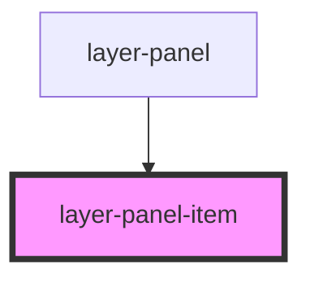

# layer-panel-item

<!-- Auto Generated Below -->

## Properties

| Property                | Attribute   | Description                                    | Type      | Default     |
| ----------------------- | ----------- | ---------------------------------------------- | --------- | ----------- |
| `canvasId` _(required)_ | `canvas-id` | Canvas ID containing this item                 | `string`  | `undefined` |
| `isActive`              | `is-active` | Whether this item is currently active/selected | `boolean` | `false`     |
| `itemId` _(required)_   | `item-id`   | Unique ID of the grid item this represents     | `string`  | `undefined` |
| `name` _(required)_     | `name`      | Display name of the item                       | `string`  | `undefined` |
| `type` _(required)_     | `type`      | Component type (for icon display)              | `string`  | `undefined` |
| `zIndex` _(required)_   | `z-index`   | Current z-index value                          | `number`  | `undefined` |

## Events

| Event                | Description                                                | Type                                                                                       |
| -------------------- | ---------------------------------------------------------- | ------------------------------------------------------------------------------------------ |
| `layerItemDragStart` | Emitted when user starts dragging this item for reordering | `CustomEvent<{ itemId: string; canvasId: string; zIndex: number; }>`                       |
| `layerItemDrop`      | Emitted when user drops this item at a new position        | `CustomEvent<{ itemId: string; canvasId: string; oldZIndex: number; newZIndex: number; }>` |
| `layerItemSelect`    | Emitted when user clicks on this item                      | `CustomEvent<{ itemId: string; canvasId: string; }>`                                       |

## Dependencies

### Used by

 - [layer-panel](../layer-panel)

### Graph

----------------------------------------------

*Built with [StencilJS](https://stenciljs.com/)*
