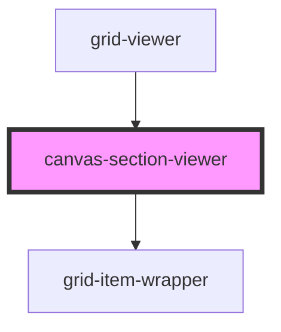

# canvas-section-viewer

<!-- Auto Generated Below -->

## Overview

CanvasSectionViewer Component
==============================

Rendering-only canvas component for grid-viewer.

**Tag**: `<canvas-section-viewer>`
**Shadow DOM**: Disabled (consistent with canvas-section)
**Reactivity**: Props-based (no global state subscription)

## Properties

| Property                       | Attribute          | Description                                                                                                                                                                                     | Type                               | Default     |
| ------------------------------ | ------------------ | ----------------------------------------------------------------------------------------------------------------------------------------------------------------------------------------------- | ---------------------------------- | ----------- |
| `backgroundColor`              | `background-color` | Background color for this canvas  **Optional**: Canvas background color **Default**: '#ffffff'                                                                                                  | `string`                           | `undefined` |
| `canvasId` _(required)_        | `canvas-id`        | Canvas ID for identification  **Format**: 'canvas1', 'hero-section', etc. **Purpose**: Element ID and data attribute                                                                            | `string`                           | `undefined` |
| `componentRegistry`            | --                 | Component registry (from parent grid-viewer)  **Source**: grid-viewer component **Structure**: Map<type, ComponentDefinition> **Purpose**: Pass to grid-item-wrapper for dynamic rendering      | `Map<string, ComponentDefinition>` | `undefined` |
| `config`                       | --                 | Grid configuration options  **Optional**: Customizes grid system behavior **Passed from**: grid-viewer component                                                                                | `GridConfig`                       | `undefined` |
| `currentViewport` _(required)_ | `current-viewport` | Current viewport mode  **Required**: 'desktop' \| 'mobile' **Source**: Passed from grid-viewer component  **Purpose**: Determines which layout to render for each item                          | `"desktop" \| "mobile"`            | `undefined` |
| `items` _(required)_           | --                 | Items to render in this canvas  **Required**: Array of GridItem objects **Source**: Passed from grid-viewer component  **Unlike canvas-section**: Items passed via props, not from global state | `GridItem[]`                       | `undefined` |

## Dependencies

### Used by

 - [grid-viewer](../grid-viewer)

### Depends on

- [grid-item-wrapper](../grid-item-wrapper)

### Graph

----------------------------------------------

*Built with [StencilJS](https://stenciljs.com/)*
