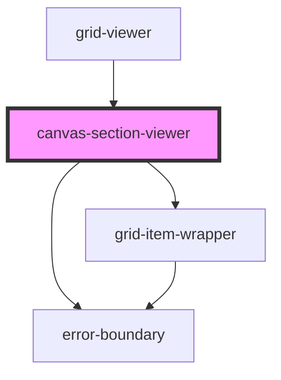

# canvas-section-viewer


<!-- Auto Generated Below -->


## Overview

CanvasSectionViewer Component
==============================

Rendering-only canvas component for grid-viewer.

**Tag**: `<canvas-section-viewer>`
**Shadow DOM**: Disabled (consistent with canvas-section)
**Reactivity**: Props-based (no global state subscription)

## Properties

| Property                       | Attribute          | Description                                                                                                                                                                                                                                                                                                                                                                                                                                                                                                                                                                                                                                                                                                                         | Type                     | Default     |
| ------------------------------ | ------------------ | ----------------------------------------------------------------------------------------------------------------------------------------------------------------------------------------------------------------------------------------------------------------------------------------------------------------------------------------------------------------------------------------------------------------------------------------------------------------------------------------------------------------------------------------------------------------------------------------------------------------------------------------------------------------------------------------------------------------------------------- | ------------------------ | ----------- |
| `backgroundColor`              | `background-color` | Background color for this canvas  **Optional**: Canvas background color **Default**: '#ffffff'                                                                                                                                                                                                                                                                                                                                                                                                                                                                                                                                                                                                                                      | `string`                 | `undefined` |
| `breakpoints`                  | `breakpoints`      | Breakpoint configuration for responsive layouts  **Optional prop**: Define custom responsive breakpoints **Source**: grid-viewer → canvas-section-viewer → grid-item-wrapper **Used by**: grid-item-wrapper for layout resolution and auto-stacking  **Purpose**: Passed through to grid-item-wrapper to enable multi-breakpoint responsive layouts in viewer mode. Grid-item-wrapper uses this to determine which layout to render, handle auto-stacking, and resolve layout inheritance.  **Example**: ```typescript const breakpoints = {   mobile: { minWidth: 0, layoutMode: 'stack' },   tablet: { minWidth: 768, layoutMode: 'inherit', inheritFrom: 'desktop' },   desktop: { minWidth: 1024, layoutMode: 'manual' } }; ``` | `any`                    | `undefined` |
| `canvasId` _(required)_        | `canvas-id`        | Canvas ID for identification  **Format**: 'canvas1', 'hero-section', etc. **Purpose**: Element ID and data attribute                                                                                                                                                                                                                                                                                                                                                                                                                                                                                                                                                                                                                | `string`                 | `undefined` |
| `componentRegistry`            | --                 | Component registry (from parent grid-viewer)  **Source**: grid-viewer component **Structure**: ComponentRegistry service instance **Purpose**: Pass to grid-item-wrapper for dynamic rendering                                                                                                                                                                                                                                                                                                                                                                                                                                                                                                                                      | `ComponentRegistry`      | `undefined` |
| `config`                       | --                 | Grid configuration options  **Optional**: Customizes grid system behavior **Passed from**: grid-viewer component                                                                                                                                                                                                                                                                                                                                                                                                                                                                                                                                                                                                                    | `GridConfig`             | `undefined` |
| `currentViewport` _(required)_ | `current-viewport` | Current viewport/breakpoint name  **Required**: string matching a breakpoint name **Examples**: 'desktop', 'mobile', 'tablet', 'xs', 'sm', 'md', 'lg', 'xl' **Source**: Passed from grid-viewer component  **Purpose**: Determines which layout to render for each item (item.layouts[currentViewport]) **Multi-breakpoint support**: Can be any breakpoint name from breakpoints config                                                                                                                                                                                                                                                                                                                                            | `string`                 | `undefined` |
| `errorAdapterInstance`         | --                 | Error adapter service instance (passed from grid-viewer)  **Optional**: Provided by grid-viewer if error handling needed **Purpose**: Support error boundary integration for item render errors **Viewer mode**: May be undefined (simplified error handling without event emission)                                                                                                                                                                                                                                                                                                                                                                                                                                                | `GridErrorAdapter`       | `undefined` |
| `items` _(required)_           | --                 | Items to render in this canvas  **Required**: Array of GridItem objects **Source**: Passed from grid-viewer component  **Unlike canvas-section**: Items passed via props, not from global state                                                                                                                                                                                                                                                                                                                                                                                                                                                                                                                                     | `GridItem[]`             | `undefined` |
| `stateInstance`                | `state-instance`   | State instance (viewer state with editing fields set to null)  **Optional**: Provided by grid-viewer to eliminate defensive guards in grid-item-wrapper **Purpose**: Provide minimal state object matching StateManager structure **Value**: ViewerState with selectedItemId/selectedCanvasId/activeCanvasId always null                                                                                                                                                                                                                                                                                                                                                                                                            | `any`                    | `undefined` |
| `virtualRendererInstance`      | --                 | Virtual renderer service instance (passed from grid-builder)  **Optional**: Provided by grid-viewer if virtual rendering enabled **Purpose**: Lazy loading of grid items for better performance                                                                                                                                                                                                                                                                                                                                                                                                                                                                                                                                     | `VirtualRendererService` | `undefined` |


## Dependencies

### Used by

 - [grid-viewer](../grid-viewer)

### Depends on

- [error-boundary](../error-boundary)
- [grid-item-wrapper](../grid-item-wrapper)

### Graph


----------------------------------------------

*Built with [StencilJS](https://stenciljs.com/)*
