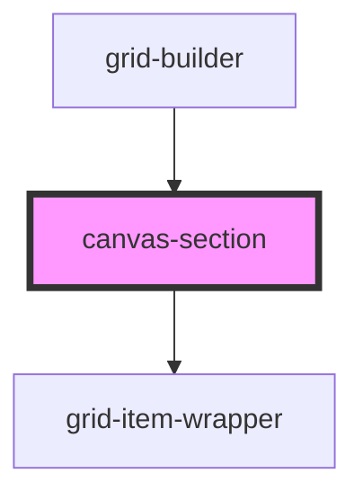

# canvas-section

<!-- Auto Generated Below -->

## Overview

CanvasSection Component
=======================

Library component providing individual canvas dropzone.

**Tag**: `<canvas-section>`
**Shadow DOM**: Disabled (required for interact.js compatibility)
**Reactivity**: Listens to gridState changes via StencilJS store

## Properties

| Property                | Attribute   | Description                                                                                                                                                                                                               | Type                               | Default     |
| ----------------------- | ----------- | ------------------------------------------------------------------------------------------------------------------------------------------------------------------------------------------------------------------------- | ---------------------------------- | ----------- |
| `canvasId` _(required)_ | `canvas-id` | Canvas ID for state management  **Format**: 'canvas1', 'canvas2', etc. **Purpose**: Key for accessing canvas data in gridState.canvases **Required**: Component won't render without valid canvasId                       | `string`                           | `undefined` |
| `componentRegistry`     | --          | Component registry (from parent grid-builder)  **Source**: grid-builder component (built from components prop) **Structure**: Map<type, ComponentDefinition> **Purpose**: Pass to grid-item-wrapper for dynamic rendering | `Map<string, ComponentDefinition>` | `undefined` |
| `config`                | --          | Grid configuration options  **Optional**: Customizes grid system behavior **Passed from**: grid-builder component **Used for**: Grid size calculations, constraints                                                       | `GridConfig`                       | `undefined` |

## Dependencies

### Used by

 - [grid-builder](../grid-builder)

### Depends on

- [grid-item-wrapper](../grid-item-wrapper)

### Graph

----------------------------------------------

*Built with [StencilJS](https://stenciljs.com/)*
