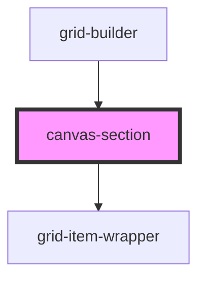

# canvas-section


<!-- Auto Generated Below -->


## Overview

CanvasSection Component
=======================

Library component providing individual canvas dropzone.

**Tag**: `<canvas-section>`
**Shadow DOM**: Disabled (required for interact.js compatibility)
**Reactivity**: Listens to gridState changes via StencilJS store

## Properties

| Property                | Attribute          | Description                                                                                                                                                                                                                                                                                                                                                                                                                                                                                                                                                                                                                  | Type                                            | Default     |
| ----------------------- | ------------------ | ---------------------------------------------------------------------------------------------------------------------------------------------------------------------------------------------------------------------------------------------------------------------------------------------------------------------------------------------------------------------------------------------------------------------------------------------------------------------------------------------------------------------------------------------------------------------------------------------------------------------------- | ----------------------------------------------- | ----------- |
| `backgroundColor`       | `background-color` | Background color for this canvas  **Host app responsibility**: Pass canvas styling from host app **Library does NOT store**: backgroundColor is presentation concern **Optional**: Defaults to '#ffffff'                                                                                                                                                                                                                                                                                                                                                                                                                     | `string`                                        | `undefined` |
| `canvasId` _(required)_ | `canvas-id`        | Canvas ID for state management  **Format**: 'canvas1', 'canvas2', etc. **Purpose**: Key for accessing canvas data in gridState.canvases **Required**: Component won't render without valid canvasId                                                                                                                                                                                                                                                                                                                                                                                                                          | `string`                                        | `undefined` |
| `canvasTitle`           | `canvas-title`     | Canvas title (from canvasMetadata)  **Optional**: Display title for this section **Renders as**: Rotated tab on right side, outside section bounds **Builder mode only**: Title tabs visible in builder, not viewer **Source**: Passed from grid-builder via canvasMetadata[canvasId].title                                                                                                                                                                                                                                                                                                                                  | `string`                                        | `undefined` |
| `componentRegistry`     | --                 | Component registry (from parent grid-builder)  **Source**: grid-builder component (built from components prop) **Structure**: Map<type, ComponentDefinition> **Purpose**: Pass to grid-item-wrapper for dynamic rendering                                                                                                                                                                                                                                                                                                                                                                                                    | `Map<string, ComponentDefinition>`              | `undefined` |
| `config`                | --                 | Grid configuration options  **Optional**: Customizes grid system behavior **Passed from**: grid-builder component **Used for**: Grid size calculations, constraints                                                                                                                                                                                                                                                                                                                                                                                                                                                          | `GridConfig`                                    | `undefined` |
| `isActive`              | `is-active`        | Whether this canvas is currently active  **Purpose**: Indicate which canvas is currently focused/active **Source**: Computed from gridState.activeCanvasId in grid-builder **Default**: false **Visual effect**: Applies 'active' CSS class to grid-container  **Canvas becomes active when**: - User clicks item on canvas - User clicks canvas background - User starts dragging item on canvas - User starts resizing item on canvas - Programmatically via api.setActiveCanvas()  **Consumer styling hook**: Consumer can style active canvas via CSS: ```css .grid-container.active .canvas-title {   opacity: 1; } ``` | `boolean`                                       | `false`     |
| `onBeforeDelete`        | --                 | Deletion hook (from parent grid-builder)  **Source**: grid-builder component (from onBeforeDelete prop) **Purpose**: Pass through to grid-item-wrapper for deletion interception **Optional**: If not provided, components delete immediately                                                                                                                                                                                                                                                                                                                                                                                | `(context: any) => boolean \| Promise<boolean>` | `undefined` |


## Dependencies

### Used by

 - [grid-builder](../grid-builder)

### Depends on

- [grid-item-wrapper](../grid-item-wrapper)

### Graph


----------------------------------------------

*Built with [StencilJS](https://stenciljs.com/)*
