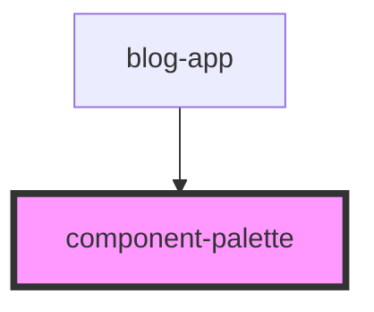

# component-palette


<!-- Auto Generated Below -->


## Overview

ComponentPalette Component
===========================

Library component providing draggable component palette UI.

**Tag**: `<component-palette>`
**Shadow DOM**: Disabled (for consistency with other components)
**Reactivity**: Re-renders when components prop changes

## Usage Patterns

**Pattern 1: Default (inside grid-builder)**
```typescript
// Palette automatically rendered by grid-builder
<grid-builder components={componentDefinitions} />
```

**Pattern 2: Independent placement**
```typescript
// Place palette anywhere in your app
<div class="my-layout">
  <aside class="sidebar">
    <component-palette
      components={componentDefinitions}
      config={gridConfig}
    />
  </aside>
  <main>
    <grid-builder
      components={componentDefinitions}
      config={gridConfig}
      uiOverrides={{
        ComponentPalette: () => null  // Hide default palette
      }}
    />
  </main>
</div>
```

**Pattern 3: Custom wrapper component**
```typescript
// Wrap in your own component for styling

## Properties

| Property              | Attribute                | Description                                                                                                                                                                                                                                                                                                                                                                                                                                                                                                                                                                                                                                                                                                                                                                                                                                                                                                                                                                                                                                                                                                      | Type                    | Default               |
| --------------------- | ------------------------ | ---------------------------------------------------------------------------------------------------------------------------------------------------------------------------------------------------------------------------------------------------------------------------------------------------------------------------------------------------------------------------------------------------------------------------------------------------------------------------------------------------------------------------------------------------------------------------------------------------------------------------------------------------------------------------------------------------------------------------------------------------------------------------------------------------------------------------------------------------------------------------------------------------------------------------------------------------------------------------------------------------------------------------------------------------------------------------------------------------------------- | ----------------------- | --------------------- |
| `componentRegistry`   | --                       | Component registry for reactive updates (Observer Pattern)  **Recommended**: Use this instead of components prop for dynamic registration **Optional prop**: ComponentRegistry instance from grid-builder **Source**: Passed from grid-builder component  **Benefits over components prop**: - Automatic palette updates when components are registered - No manual synchronization needed - Framework-driven reactive pattern  **Use case - Dynamic component registration**: ```typescript // In grid-builder story or consumer code const builderEl = document.querySelector('grid-builder'); const paletteEl = document.querySelector('component-palette');  // Share the registry (automatic sync!) paletteEl.componentRegistry = builderEl.componentRegistry;  // Register new component - palette updates automatically! const api = window.gridBuilderAPI; api.registerComponent(newComponentDef); ```  **Priority**: If both components and componentRegistry are provided, componentRegistry takes precedence                                                                                          | `ComponentRegistry`     | `undefined`           |
| `components`          | --                       | Component definitions to render in palette  **Deprecated**: Use componentRegistry prop for reactive updates **Backward compatibility**: Still supported for static component lists **Source**: Passed from grid-builder component or consumer code  **Each definition provides**: - type: Unique identifier for component - name: Display name in palette - icon: Visual identifier (emoji recommended) - defaultSize: Size when dropped (for drag clone sizing)  **Example**: ```typescript const components = [   {     type: 'header',     name: 'Header',     icon: '📄',     defaultSize: { width: 20, height: 8 },     render: ({ itemId, config }) => <my-header itemId={itemId} config={config} />   } ]; ```                                                                                                                                                                                                                                                                                                                                                                                            | `ComponentDefinition[]` | `undefined`           |
| `config`              | --                       | Grid configuration options  **Optional prop**: Customizes grid system behavior **Passed from**: grid-builder component **Used for**: Drag clone sizing (gridToPixelsX/Y calculations)                                                                                                                                                                                                                                                                                                                                                                                                                                                                                                                                                                                                                                                                                                                                                                                                                                                                                                                            | `GridConfig`            | `undefined`           |
| `paletteLabel`        | `palette-label`          | Custom label for this palette instance  **Optional prop**: Provides a descriptive label for this specific palette **Default**: "Component palette" **Used for**: ARIA label on toolbar container  **Use case - Multiple palettes**: When multiple component palettes exist on the same page (e.g., categorized palettes), provide unique labels for screen reader users:  ```typescript <component-palette components={contentComponents} paletteLabel="Content components" /> <component-palette components={mediaComponents} paletteLabel="Media components" /> <component-palette components={interactiveComponents} paletteLabel="Interactive components" /> ```  **Accessibility benefit**: - Screen readers announce: "Content components, toolbar" - Users can navigate between palettes by their distinct labels - Each palette has unique ARIA IDs to avoid conflicts                                                                                                                                                                                                                                   | `string`                | `"Component palette"` |
| `showHeader`          | `show-header`            | Show palette header (title)  **Optional prop**: Controls whether the "Components" header is displayed **Default**: true (shows header for backward compatibility)  **Use cases**: - `showHeader={true}` (default): Standard palette with "Components" title - `showHeader={false}`: Chromeless mode - just the component list  **Chromeless mode benefits**: - Embed palette in custom layouts - Add your own headers/titles - Integrate into existing UI structures - More flexible component placement  **Example - Chromeless with custom wrapper**: ```typescript <div class="my-custom-sidebar"> <h3 class="my-title">Available Components</h3> <p class="my-description">Drag to add</p> <component-palette components={componentDefinitions} showHeader={false} /> </div> ```                                                                                                                                                                                                                                                                                                                             | `boolean`               | `true`                |
| `targetGridBuilderId` | `target-grid-builder-id` | Target grid-builder instance ID  **Optional prop**: Specifies which grid-builder instance should receive click-to-add events **Default**: undefined (events received by all grid-builder instances) **Used for**: Multi-instance scenarios with multiple grid-builders on the same page  **Use case - Multiple grid-builders**: When multiple grid-builder instances exist on the same page, use this prop to route palette events to a specific instance:  ```typescript // Grid builders with different API keys <grid-builder api-ref={{ key: 'gridAPI1' }} components={...} /> <grid-builder api-ref={{ key: 'gridAPI2' }} components={...} />  // Palettes targeting specific builders <component-palette   components={components}   targetGridBuilderId="gridAPI1" /> <component-palette   components={components}   targetGridBuilderId="gridAPI2" /> ```  **How it works**: - Palette includes `targetGridBuilderId` in `palette-item-click` event detail - Grid-builder filters events by matching against its own instance ID - If omitted, all grid-builders receive the event (backward compatible) | `string`                | `undefined`           |


## Dependencies

### Used by

 - [blog-app](../../demo/components/blog-app)

### Graph


----------------------------------------------

*Built with [StencilJS](https://stenciljs.com/)*
