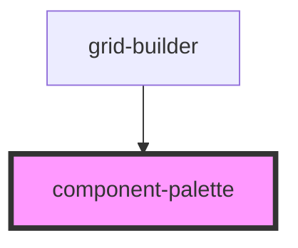

# component-palette


<!-- Auto Generated Below -->


## Overview

ComponentPalette Component
===========================

Library component providing draggable component palette UI.

**Tag**: `<component-palette>`
**Shadow DOM**: Disabled (for consistency with other components)
**Reactivity**: Re-renders when components prop changes

## Properties

| Property                  | Attribute | Description                                                                                                                                                                                                                                                                                                                                                                                                                                                                                                                                                                                                           | Type                    | Default     |
| ------------------------- | --------- | --------------------------------------------------------------------------------------------------------------------------------------------------------------------------------------------------------------------------------------------------------------------------------------------------------------------------------------------------------------------------------------------------------------------------------------------------------------------------------------------------------------------------------------------------------------------------------------------------------------------- | ----------------------- | ----------- |
| `components` _(required)_ | --        | Component definitions to render in palette  **Required prop**: Array of ComponentDefinition objects **Source**: Passed from grid-builder component  **Each definition provides**: - type: Unique identifier for component - name: Display name in palette - icon: Visual identifier (emoji recommended) - defaultSize: Size when dropped (for drag clone sizing)  **Example**: ```typescript const components = [   {     type: 'header',     name: 'Header',     icon: '📄',     defaultSize: { width: 20, height: 8 },     render: ({ itemId, config }) => <my-header itemId={itemId} config={config} />   } ]; ``` | `ComponentDefinition[]` | `undefined` |
| `config`                  | --        | Grid configuration options  **Optional prop**: Customizes grid system behavior **Passed from**: grid-builder component **Used for**: Drag clone sizing (gridToPixelsX/Y calculations)                                                                                                                                                                                                                                                                                                                                                                                                                                 | `GridConfig`            | `undefined` |


## Dependencies

### Used by

 - [grid-builder](../grid-builder)

### Graph


----------------------------------------------

*Built with [StencilJS](https://stenciljs.com/)*
