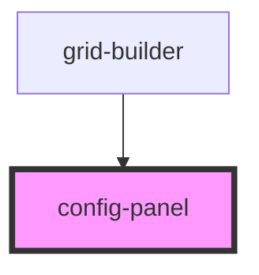

# config-panel

<!-- Auto Generated Below -->

## Overview

ConfigPanel Component
=====================

Library component providing configuration panel with auto-generated and custom forms.

**Tag**: `<config-panel>`
**Shadow DOM**: Disabled (for consistency with other components)

## Properties

| Property            | Attribute | Description                                                                                                                                   | Type                               | Default     |
| ------------------- | --------- | --------------------------------------------------------------------------------------------------------------------------------------------- | ---------------------------------- | ----------- |
| `componentRegistry` | --        | Component registry (from parent grid-builder)  **Source**: grid-builder component **Purpose**: Look up component definitions for config forms | `Map<string, ComponentDefinition>` | `undefined` |

## Dependencies

### Used by

 - [grid-builder](../grid-builder)

### Graph

----------------------------------------------

*Built with [StencilJS](https://stenciljs.com/)*
