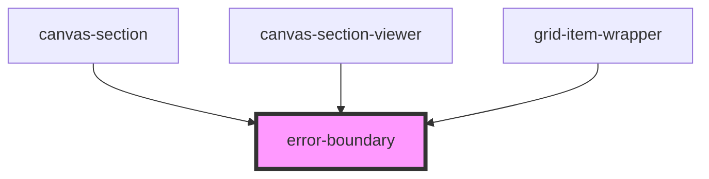

# error-boundary


<!-- Auto Generated Below -->


## Overview

ErrorBoundary Component
========================

Generic error boundary for catching component render errors.

**Tag**: `<error-boundary>`
**Shadow DOM**: Disabled (allows slot content to access parent styles)
**Reusable**: Zero dependencies, can be extracted to standalone package

## Properties

| Property                     | Attribute           | Description                                                                                                                                                                                                                                                                                                                                                                                                                                                                                | Type                                                                  | Default     |
| ---------------------------- | ------------------- | ------------------------------------------------------------------------------------------------------------------------------------------------------------------------------------------------------------------------------------------------------------------------------------------------------------------------------------------------------------------------------------------------------------------------------------------------------------------------------------------ | --------------------------------------------------------------------- | ----------- |
| `context`                    | --                  | Additional context for error info  **Purpose**: Add domain-specific context to error events **Default**: {}  **Example** (grid-builder specific): ```typescript <error-boundary context={{ itemId: 'item-123', canvasId: 'canvas1' }}>   ... </error-boundary> ```                                                                                                                                                                                                                         | `{ [x: string]: any; }`                                               | `undefined` |
| `errorBoundary` _(required)_ | `error-boundary`    | Error boundary identifier  **Purpose**: Identifies which boundary caught the error **Required**: Yes **Example**: 'grid-builder', 'canvas-section', 'grid-item-wrapper'  **Used in error events**: Helps parent components know where error originated                                                                                                                                                                                                                                     | `string`                                                              | `undefined` |
| `errorFallback`              | --                  | Custom error fallback renderer  **Purpose**: Render custom error UI **Default**: Uses default error UI (red box with message)  **Function signature**: ```typescript (error: Error, errorInfo: BaseErrorInfo, retry?: () => void) => any ```  **Example**: ```typescript errorBoundaryEl.errorFallback = (error, errorInfo, retry) => (   <div class="custom-error">     <h3>{error.message}</h3>     <button onClick={retry}>Try Again</button>   </div> ); ```                           | `(error: Error, errorInfo: BaseErrorInfo, retry?: () => void) => any` | `undefined` |
| `recoveryStrategy`           | `recovery-strategy` | Error recovery strategy  **Purpose**: Control how component recovers from errors **Default**: Auto-determined from error classification  **Strategies**: - `graceful`: Show fallback UI, emit event, continue operation - `strict`: Re-throw error, propagate to parent - `retry`: Attempt automatic retry (not implemented for render errors) - `ignore`: Swallow error, render nothing  **Example**: ```typescript <error-boundary recovery-strategy="graceful">...</error-boundary> ``` | `"graceful" \| "ignore" \| "retry" \| "strict"`                       | `undefined` |
| `showErrorUI`                | `show-error-u-i`    | Whether to show error UI  **Purpose**: Control error UI visibility **Default**: `process.env.NODE_ENV !== 'production'` (show in dev, hide in prod)  **Override behavior**: - `true`: Always show error UI - `false`: Never show error UI (emit event only) - `undefined`: Environment-based (dev: show, prod: hide)  **Example**: ```typescript <error-boundary show-error-ui={true}>...</error-boundary> ```                                                                             | `boolean`                                                             | `undefined` |


## Events

| Event   | Description                                                                                                                                                                                                                                                                                                                                                                                                                                                                                                                                                                                                                                                                                          | Type                                |
| ------- | ---------------------------------------------------------------------------------------------------------------------------------------------------------------------------------------------------------------------------------------------------------------------------------------------------------------------------------------------------------------------------------------------------------------------------------------------------------------------------------------------------------------------------------------------------------------------------------------------------------------------------------------------------------------------------------------------------- | ----------------------------------- |
| `error` | Error event emitter  **Purpose**: Notify parent components of errors **Event name**: 'error' **Detail type**: BaseErrorEventDetail  **Event structure**: ```typescript {   error: Error,              // The caught error   errorInfo: {     errorBoundary: string,   // Which boundary caught it     timestamp: number,     userAgent: string,     componentStack?: string,     ...context               // Additional context   },   severity: 'critical' \| 'error' \| 'warning' \| 'info',   recoverable: boolean } ```  **Example**: ```typescript <error-boundary onError={(e) => {   console.error('Error caught:', e.detail.error);   logToSentry(e.detail); }}>   ... </error-boundary> ``` | `CustomEvent<BaseErrorEventDetail>` |


## Dependencies

### Used by

 - [canvas-section](../canvas-section)
 - [canvas-section-viewer](../canvas-section-viewer)
 - [grid-item-wrapper](../grid-item-wrapper)

### Graph


----------------------------------------------

*Built with [StencilJS](https://stenciljs.com/)*
