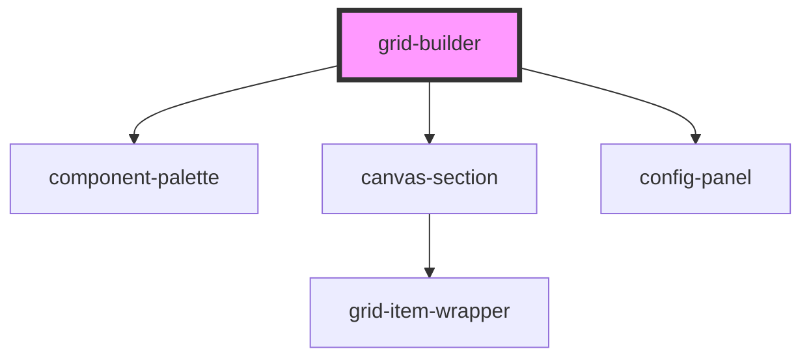

# grid-builder


<!-- Auto Generated Below -->


## Overview

GridBuilder Component
======================

Main library component providing complete grid builder functionality.

**Tag**: `<grid-builder>`
**Shadow DOM**: Disabled (required for interact.js compatibility)
**Reactivity**: Listens to gridState changes via StencilJS store

## Properties

| Property                  | Attribute | Description                                                                                                                                                                                                                                                                                                                                                                                                                                                                                                                                                                                                                                                                                                                                                                                                                                                                                                                                                                   | Type                                                                                                                                                      | Default     |
| ------------------------- | --------- | ----------------------------------------------------------------------------------------------------------------------------------------------------------------------------------------------------------------------------------------------------------------------------------------------------------------------------------------------------------------------------------------------------------------------------------------------------------------------------------------------------------------------------------------------------------------------------------------------------------------------------------------------------------------------------------------------------------------------------------------------------------------------------------------------------------------------------------------------------------------------------------------------------------------------------------------------------------------------------- | --------------------------------------------------------------------------------------------------------------------------------------------------------- | ----------- |
| `components` _(required)_ | --        | Component definitions registry  **Required prop**: Array of ComponentDefinition objects **Purpose**: Defines available component types (header, text, button, etc.)  **Each definition includes**: - type: Unique identifier (e.g., 'header', 'text-block') - name: Display name in palette - icon: Visual identifier (emoji recommended) - defaultSize: Initial size when dropped - render: Function returning component to render - configSchema: Optional auto-generated config form - renderConfigPanel: Optional custom config UI - Lifecycle hooks: onVisible, onHidden for virtual rendering  **Example**: ```typescript const components = [   {     type: 'header',     name: 'Header',     icon: '📄',     defaultSize: { width: 20, height: 8 },     render: ({ itemId, config }) => (       <my-header itemId={itemId} config={config} />     ),     configSchema: [       { name: 'text', label: 'Text', type: 'text', defaultValue: 'Header' }     ]   } ]; ``` | `ComponentDefinition[]`                                                                                                                                   | `undefined` |
| `config`                  | --        | Grid configuration options  **Optional prop**: Customizes grid system behavior **Default**: Standard 2% grid with 10px-50px constraints  **Configuration options**: - gridSizePercent: Grid unit as % of width (default: 2) - minGridSize: Minimum size in pixels (default: 10) - maxGridSize: Maximum size in pixels (default: 50) - snapToGrid: Enable snap-to-grid (default: true) - showGridLines: Show visual grid (default: true) - minItemSize: Minimum item dimensions (default: { width: 5, height: 4 }) - virtualRenderMargin: Pre-render margin (default: '20%')  **Example**: ```typescript const config = {   gridSizePercent: 3,           // 3% grid (33 units per 100%)   minGridSize: 15,              // 15px minimum   maxGridSize: 60,              // 60px maximum   snapToGrid: true,   virtualRenderMargin: '30%'    // Aggressive pre-loading }; ```                                                                                                  | `GridConfig`                                                                                                                                              | `undefined` |
| `initialState`            | --        | Initial state to restore  **Optional prop**: Restore saved layout **Purpose**: Load previously saved grid state  **State structure**: Same as gridState (canvases, viewport, etc.)  **Example**: ```typescript const savedState = JSON.parse(localStorage.getItem('grid-state')); <grid-builder initialState={savedState} ... /> ```                                                                                                                                                                                                                                                                                                                                                                                                                                                                                                                                                                                                                                          | `{ canvases?: Record<string, Canvas>; selectedItemId?: string; selectedCanvasId?: string; currentViewport?: "desktop" \| "mobile"; showGrid?: boolean; }` | `undefined` |
| `plugins`                 | --        | Plugin instances for extending functionality  **Optional prop**: Array of GridBuilderPlugin instances **Purpose**: Add custom features, analytics, integrations  **Plugin lifecycle**: 1. Library calls plugin.init(api) on componentDidLoad 2. Plugin subscribes to events, adds UI, etc. 3. Library calls plugin.destroy() on disconnectedCallback  **Example**: ```typescript class AnalyticsPlugin implements GridBuilderPlugin {   name = 'analytics';    init(api: GridBuilderAPI) {     api.on('componentAdded', (e) => {       analytics.track('Component Added', { type: e.item.type });     });   }    destroy() {     // Cleanup   } }  const plugins = [new AnalyticsPlugin()]; ```                                                                                                                                                                                                                                                                               | `GridBuilderPlugin[]`                                                                                                                                     | `undefined` |
| `theme`                   | --        | Visual theme customization  **Optional prop**: Customizes colors, fonts, and styling **Default**: Bootstrap-inspired blue theme  **Theme options**: - primaryColor: Accent color (default: '#007bff') - paletteBackground: Palette sidebar color (default: '#f5f5f5') - canvasBackground: Canvas background (default: '#ffffff') - gridLineColor: Grid line color (default: 'rgba(0,0,0,0.1)') - selectionColor: Selection outline (default: '#007bff') - resizeHandleColor: Resize handle color (default: '#007bff') - fontFamily: UI font (default: system font stack) - customProperties: CSS variables for advanced theming  **Example**: ```typescript const theme = {   primaryColor: '#ff6b6b',        // Brand red   paletteBackground: '#fff5f5',   // Light red   customProperties: {     '--text-color': '#ffffff',     '--border-radius': '8px'   } }; ```                                                                                                        | `GridBuilderTheme`                                                                                                                                        | `undefined` |
| `uiOverrides`             | --        | Custom UI component overrides  **Optional prop**: Replace default UI components **Purpose**: Fully customize visual appearance  **Overridable components**: - ConfigPanel: Configuration panel UI - ComponentPalette: Component palette sidebar - Toolbar: Top toolbar with controls  **Example**: ```typescript const uiOverrides = {   Toolbar: (props) => (     <div class="my-toolbar">       <button onClick={props.onUndo}>Undo</button>       <button onClick={props.onRedo}>Redo</button>     </div>   ) }; ```                                                                                                                                                                                                                                                                                                                                                                                                                                                       | `UIComponentOverrides`                                                                                                                                    | `undefined` |


## Dependencies

### Depends on

- [component-palette](../component-palette)
- [canvas-section](../canvas-section)
- [config-panel](../config-panel)

### Graph


----------------------------------------------

*Built with [StencilJS](https://stenciljs.com/)*
