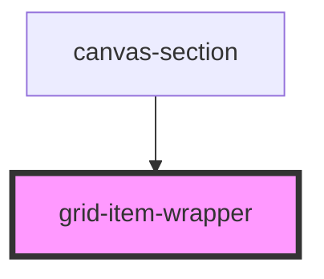

# grid-item-wrapper

<!-- Auto Generated Below -->

## Overview

GridItemWrapper Component
==========================

Library component wrapping individual grid items with drag/resize/selection.

**Tag**: `<grid-item-wrapper>`
**Shadow DOM**: Disabled (required for interact.js compatibility)
**Dynamic rendering**: Uses ComponentDefinition.render() from registry

## Properties

| Property            | Attribute        | Description                                                                                                                                                                                                                                                                                                                                                                                                                        | Type                                            | Default     |
| ------------------- | ---------------- | ---------------------------------------------------------------------------------------------------------------------------------------------------------------------------------------------------------------------------------------------------------------------------------------------------------------------------------------------------------------------------------------------------------------------------------- | ----------------------------------------------- | ----------- |
| `componentRegistry` | --               | Component registry (from parent grid-builder)  **Source**: grid-builder component (built from components prop) **Structure**: Map<type, ComponentDefinition> **Purpose**: Look up component definitions for dynamic rendering  **Note**: This is passed as a workaround since StencilJS doesn't have good support for context/provide-inject patterns. In a production app, consider using a global registry or context provider.  | `Map<string, ComponentDefinition>`              | `undefined` |
| `config`            | --               | Grid configuration options  **Optional**: Customizes grid system behavior **Passed from**: grid-builder → canvas-section → grid-item-wrapper **Used for**: Grid size calculations with constraints                                                                                                                                                                                                                                 | `GridConfig`                                    | `undefined` |
| `item` _(required)_ | --               | Grid item data (position, size, type, etc.)  **Source**: Parent canvas-section component **Contains**: id, canvasId, type, name, layouts (desktop/mobile), zIndex, config                                                                                                                                                                                                                                                          | `GridItem`                                      | `undefined` |
| `onBeforeDelete`    | --               | Deletion hook (from parent grid-builder)  **Source**: grid-builder component (from onBeforeDelete prop) **Purpose**: Allow host app to intercept deletion requests  **Hook behavior**: - Called before deleting a component - Receives context with item data - Returns true/false or Promise<boolean> - If false, deletion is cancelled - If true, deletion proceeds  **Default**: If not provided, components delete immediately | `(context: any) => boolean \| Promise<boolean>` | `undefined` |
| `renderVersion`     | `render-version` | Render version (force re-render trigger)  **Source**: Parent canvas-section (incremented on resize) **Purpose**: Force grid calculation refresh when container resizes                                                                                                                                                                                                                                                             | `number`                                        | `undefined` |

## Dependencies

### Used by

 - [canvas-section](../canvas-section)

### Graph

----------------------------------------------

*Built with [StencilJS](https://stenciljs.com/)*
