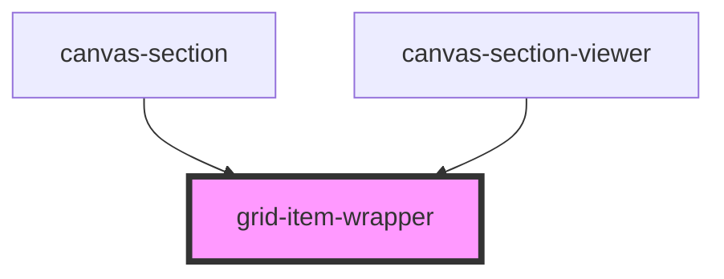

# grid-item-wrapper

<!-- Auto Generated Below -->

## Overview

GridItemWrapper Component
==========================

Library component wrapping individual grid items with drag/resize/selection.

**Tag**: `<grid-item-wrapper>`
**Shadow DOM**: Disabled (required for interact.js compatibility)
**Dynamic rendering**: Uses ComponentDefinition.render() from registry

## Properties

| Property                  | Attribute          | Description                                                                                                                                                                                                                                                                                                                                                                                                                                                                                                   | Type                                            | Default     |
| ------------------------- | ------------------ | ------------------------------------------------------------------------------------------------------------------------------------------------------------------------------------------------------------------------------------------------------------------------------------------------------------------------------------------------------------------------------------------------------------------------------------------------------------------------------------------------------------- | ----------------------------------------------- | ----------- |
| `canvasItems`             | --                 | All items in the canvas (for viewer mode auto-layout)  **Purpose**: Calculate mobile auto-layout positions **Source**: grid-viewer → canvas-section-viewer → grid-item-wrapper **Used by**: render() to calculate stacked positions in mobile viewport  **Note**: When in builder mode (viewerMode=false), this is ignored and gridState.canvases is used instead. When in viewer mode (viewerMode=true), this prop is required for mobile auto-layout.                                                       | `GridItem[]`                                    | `undefined` |
| `componentRegistry`       | --                 | Component registry (from parent grid-builder)  **Source**: grid-builder component (built from components prop) **Structure**: Map<type, ComponentDefinition> **Purpose**: Look up component definitions for dynamic rendering  **Note**: This is passed as a workaround since StencilJS doesn't have good support for context/provide-inject patterns. In a production app, consider using a global registry or context provider.                                                                             | `Map<string, ComponentDefinition>`              | `undefined` |
| `config`                  | --                 | Grid configuration options  **Optional**: Customizes grid system behavior **Passed from**: grid-builder → canvas-section → grid-item-wrapper **Used for**: Grid size calculations with constraints                                                                                                                                                                                                                                                                                                            | `GridConfig`                                    | `undefined` |
| `currentViewport`         | `current-viewport` | Current viewport (for viewer mode)  **Purpose**: Determine which layout to render (desktop or mobile) **Source**: grid-viewer → canvas-section-viewer → grid-item-wrapper **Used by**: render() to select appropriate layout  **Note**: When in builder mode (viewerMode=false), this is ignored and gridState.currentViewport is used instead. When in viewer mode (viewerMode=true), this prop is required.                                                                                                 | `"desktop" \| "mobile"`                         | `undefined` |
| `domCacheInstance`        | --                 | DOM cache service instance (passed from grid-builder)  **Required for editing mode** (grid-builder provides this) **Optional for viewer mode** (grid-viewer doesn't need it)  **Source**: grid-builder → canvas-section → grid-item-wrapper **Purpose**: Support multiple grid-builder instances with isolated DOM caches **Used by**: DragHandler, ResizeHandler for fast canvas element lookups                                                                                                             | `DOMCache`                                      | `undefined` |
| `eventManagerInstance`    | --                 | Event manager service instance (passed from grid-builder)  **Required for editing mode** (grid-builder provides this) **Optional for viewer mode** (grid-viewer doesn't need it)  **Source**: grid-builder → canvas-section → grid-item-wrapper **Purpose**: Support multiple grid-builder instances with isolated services                                                                                                                                                                                   | `EventManager`                                  | `undefined` |
| `item` _(required)_       | --                 | Grid item data (position, size, type, etc.)  **Source**: Parent canvas-section component **Contains**: id, canvasId, type, name, layouts (desktop/mobile), zIndex, config                                                                                                                                                                                                                                                                                                                                     | `GridItem`                                      | `undefined` |
| `onBeforeDelete`          | --                 | Deletion hook (from parent grid-builder)  **Source**: grid-builder component (from onBeforeDelete prop) **Purpose**: Allow host app to intercept deletion requests  **Hook behavior**: - Called before deleting a component - Receives context with item data - Returns true/false or Promise<boolean> - If false, deletion is cancelled - If true, deletion proceeds  **Default**: If not provided, components delete immediately                                                                            | `(context: any) => boolean \| Promise<boolean>` | `undefined` |
| `renderVersion`           | `render-version`   | Render version (force re-render trigger)  **Source**: Parent canvas-section (incremented on resize) **Purpose**: Force grid calculation refresh when container resizes                                                                                                                                                                                                                                                                                                                                        | `number`                                        | `undefined` |
| `stateInstance`           | `state-instance`   | State manager instance (passed from grid-builder)  **Required for editing mode** (grid-builder provides this) **Optional for viewer mode** (grid-viewer doesn't need it)  **Source**: grid-builder → canvas-section → grid-item-wrapper **Purpose**: Support multiple grid-builder instances with isolated state **Used by**: DragHandler, ResizeHandler for accessing canvases and viewport                                                                                                                  | `any`                                           | `undefined` |
| `theme`                   | `theme`            | Theme configuration (from parent grid-builder)  **Source**: grid-builder → canvas-section → grid-item-wrapper **Purpose**: Access theme.selectionColor for component selection styling  **Fallback chain for selection color**: 1. ComponentDefinition.selectionColor (per-component override) 2. theme.selectionColor (global theme default) 3. "#f59e0b" (hardcoded fallback - amber/gold)  **Why passed**: grid-item-wrapper doesn't have access to global theme, so must be passed through component tree | `any`                                           | `undefined` |
| `undoRedoManagerInstance` | --                 | Undo/Redo manager service instance (passed from grid-builder)  **Required for editing mode** (grid-builder provides this) **Optional for viewer mode** (grid-viewer doesn't need it)  **Source**: grid-builder → canvas-section → grid-item-wrapper **Purpose**: Support multiple grid-builder instances with isolated undo/redo stacks **Used by**: handleItemUpdate() for pushing move/resize commands to undo stack                                                                                        | `UndoRedoManager`                               | `undefined` |
| `viewerMode`              | `viewer-mode`      | Viewer mode flag  **Purpose**: Disable editing features for rendering-only mode **Default**: false (editing enabled)  **When true**: - ❌ No drag-and-drop handlers - ❌ No resize handles - ❌ No item header (drag handle) - ❌ No delete button - ❌ No selection state - ✅ Only renders component content  **Use case**: grid-viewer component for display-only mode                                                                                                                                           | `boolean`                                       | `false`     |
| `virtualRendererInstance` | --                 | Virtual renderer service instance (passed from grid-builder)  **Required for editing mode** (grid-builder provides this) **Optional for viewer mode** (grid-viewer doesn't need it)  **Source**: grid-builder → canvas-section → grid-item-wrapper **Purpose**: Support multiple grid-builder instances with isolated services                                                                                                                                                                                | `VirtualRendererService`                        | `undefined` |

## Dependencies

### Used by

 - [canvas-section](../canvas-section)
 - [canvas-section-viewer](../canvas-section-viewer)

### Graph

----------------------------------------------

*Built with [StencilJS](https://stenciljs.com/)*
