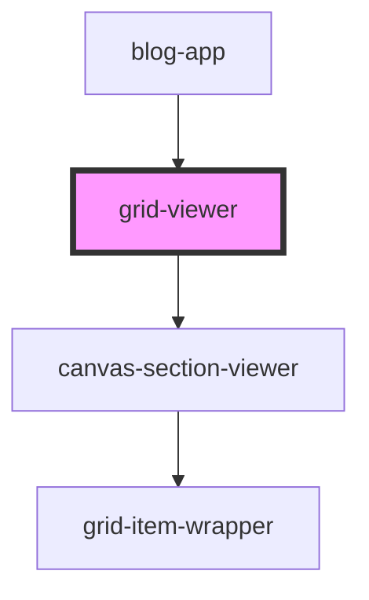

# grid-viewer


<!-- Auto Generated Below -->


## Overview

GridViewer Component
====================

Rendering-only grid component for displaying layouts created in grid-builder.

**Tag**: `<grid-viewer>`
**Shadow DOM**: Disabled (consistent with grid-builder)
**Reactivity**: Uses local store for viewer state

**Key differences from grid-builder**:
- No interact.js dependency (80% bundle size reduction)
- No palette, config panel, or editing UI
- Simplified state (no selection, no z-index tracking)
- Rendering-only canvas sections

## Properties

| Property                  | Attribute | Description                                                                                                                                                                                                                                                                                                                                                                                                                                         | Type                                                                                                                                                                               | Default     |
| ------------------------- | --------- | --------------------------------------------------------------------------------------------------------------------------------------------------------------------------------------------------------------------------------------------------------------------------------------------------------------------------------------------------------------------------------------------------------------------------------------------------- | ---------------------------------------------------------------------------------------------------------------------------------------------------------------------------------- | ----------- |
| `canvasMetadata`          | --        | Canvas metadata storage (host app responsibility)  **Optional prop**: Store canvas-level presentation metadata **Purpose**: Host app owns canvas metadata (titles, colors, settings)  **Structure**: Record<canvasId, any>  **Example**: ```typescript const canvasMetadata = {   'hero-section': {     backgroundColor: '#f0f4f8',     customSettings: { ... }   } }; ```                                                                          | `{ [x: string]: any; }`                                                                                                                                                            | `undefined` |
| `components` _(required)_ | --        | Component definitions registry  **Required prop**: Array of ComponentDefinition objects **Purpose**: Defines how to render each component type  **Must match builder definitions**: Same component types as used in builder  **Example**: ```typescript const components = [   {     type: 'header',     name: 'Header',     icon: '📄',     render: ({ itemId, config }) => (       <my-header itemId={itemId} config={config} />     )   } ]; ``` | `ComponentDefinition[]`                                                                                                                                                            | `undefined` |
| `config`                  | --        | Grid configuration options  **Optional prop**: Grid system configuration **Default**: Standard 2% grid with 10px-50px constraints  **Should match builder config**: Use same config as builder for consistent rendering                                                                                                                                                                                                                             | `GridConfig`                                                                                                                                                                       | `undefined` |
| `initialState`            | --        | Initial state to display  **Optional prop**: Layout data to render **Accepts**: ViewerState or GridExport (both compatible)  **From builder export**: ```typescript const exportData = await builder.exportState(); viewer.initialState = exportData; // Type-safe! ```  **From API**: ```typescript const layout = await fetch('/api/layouts/123').then(r => r.json()); viewer.initialState = layout; ```                                          | `GridExport \| { canvases?: Record<string, ViewerCanvas>; currentViewport?: "desktop" \| "mobile"; selectedItemId?: string; selectedCanvasId?: string; activeCanvasId?: string; }` | `undefined` |
| `theme`                   | --        | Visual theme customization  **Optional prop**: Customizes colors, fonts, and styling **Default**: Bootstrap-inspired blue theme                                                                                                                                                                                                                                                                                                                     | `GridBuilderTheme`                                                                                                                                                                 | `undefined` |


## Dependencies

### Used by

 - [blog-app](../../demo/components/blog-app)

### Depends on

- [canvas-section-viewer](../canvas-section-viewer)

### Graph


----------------------------------------------

*Built with [StencilJS](https://stenciljs.com/)*
