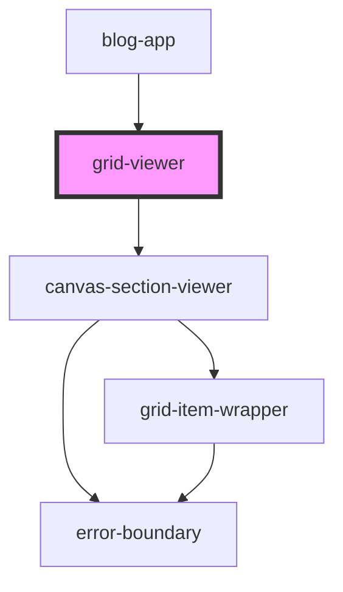

# grid-viewer


<!-- Auto Generated Below -->


## Overview

GridViewer Component
====================

Rendering-only grid component for displaying layouts created in grid-builder.

**Tag**: `<grid-viewer>`
**Shadow DOM**: Disabled (consistent with grid-builder)
**Reactivity**: Uses local store OR shared store (via apiKey prop)

**Key differences from grid-builder**:
- No interact.js dependency (80% bundle size reduction)
- No palette, config panel, or editing UI
- Simplified state (no selection, no z-index tracking)
- Rendering-only canvas sections

**Multi-instance sharing**:
- **Local mode** (default): Each instance has independent state
- **Shared mode** (with apiKey): Multiple instances share layout data
- Same SharedStateRegistry pattern as grid-builder
- Use case: Multi-device preview (mobile + tablet + desktop side-by-side)

## Properties

| Property                  | Attribute     | Description                                                                                                                                                                                                                                                                                                                                                                                                                                                                                                                                                                                                                                                                                                                                                                                                                                                              | Type                                                                                                                                                                                                | Default     |
| ------------------------- | ------------- | ------------------------------------------------------------------------------------------------------------------------------------------------------------------------------------------------------------------------------------------------------------------------------------------------------------------------------------------------------------------------------------------------------------------------------------------------------------------------------------------------------------------------------------------------------------------------------------------------------------------------------------------------------------------------------------------------------------------------------------------------------------------------------------------------------------------------------------------------------------------------ | --------------------------------------------------------------------------------------------------------------------------------------------------------------------------------------------------- | ----------- |
| `apiKey`                  | `api-key`     | API key for shared state across multiple instances  **Optional prop**: Enables multi-instance sharing **Purpose**: Multiple grid-viewer instances with same apiKey share layout data  **Use cases**: - Multi-device preview (mobile + tablet + desktop views side-by-side) - Collaborative viewing (multiple users viewing same layout) - Live updates across instances  **Shared data**: Canvas items and layouts **Instance-specific**: Current viewport (each instance can show different viewport)  **Example**: ```typescript // Instance 1: Mobile view <grid-viewer apiKey="demo-layout" breakpoints={{ mobile: 0, desktop: 768 }}></grid-viewer>  // Instance 2: Desktop view (shares data with Instance 1) <grid-viewer apiKey="demo-layout" breakpoints={{ mobile: 0, desktop: 768 }}></grid-viewer> ```  **Default**: undefined (local-only mode, no sharing) | `string`                                                                                                                                                                                            | `undefined` |
| `breakpoints`             | `breakpoints` | Breakpoint configuration for responsive layouts  **Optional prop**: Define custom responsive breakpoints **Default**: `{ mobile: { minWidth: 0, layoutMode: 'stack' }, desktop: { minWidth: 768, layoutMode: 'manual' } }` **Backwards compatible**: Existing desktop/mobile behavior maintained by default  **Should match builder config**: Use same breakpoints as builder for consistent behavior  **Examples**:  1. **Simple format** (min-width only): ```typescript <grid-viewer breakpoints={{ mobile: 0, desktop: 768 }}></grid-viewer> ```  2. **Full format** (3 breakpoints with layout modes): ```typescript <grid-viewer breakpoints={{   mobile: { minWidth: 0, layoutMode: 'stack' },   tablet: { minWidth: 768, layoutMode: 'inherit', inheritFrom: 'desktop' },   desktop: { minWidth: 1024, layoutMode: 'manual' } }}></grid-viewer> ```              | `any`                                                                                                                                                                                               | `undefined` |
| `canvasMetadata`          | --            | Canvas metadata storage (host app responsibility)  **Optional prop**: Store canvas-level presentation metadata **Purpose**: Host app owns canvas metadata (titles, colors, settings)  **Structure**: Record<canvasId, any>  **Example**: ```typescript const canvasMetadata = {   'hero-section': {     backgroundColor: '#f0f4f8',     customSettings: { ... }   } }; ```                                                                                                                                                                                                                                                                                                                                                                                                                                                                                               | `{ [x: string]: any; }`                                                                                                                                                                             | `undefined` |
| `components` _(required)_ | --            | Component definitions registry  **Required prop**: Array of ComponentDefinition objects **Purpose**: Defines how to render each component type  **Must match builder definitions**: Same component types as used in builder  **Example**: ```typescript const components = [   {     type: 'header',     name: 'Header',     icon: '📄',     render: ({ itemId, config }) => (       <my-header itemId={itemId} config={config} />     )   } ]; ```                                                                                                                                                                                                                                                                                                                                                                                                                      | `ComponentDefinition[]`                                                                                                                                                                             | `undefined` |
| `config`                  | --            | Grid configuration options  **Optional prop**: Grid system configuration **Default**: Standard 2% grid with 10px-50px constraints  **Should match builder config**: Use same config as builder for consistent rendering                                                                                                                                                                                                                                                                                                                                                                                                                                                                                                                                                                                                                                                  | `GridConfig`                                                                                                                                                                                        | `undefined` |
| `initialState`            | --            | Initial state to display  **Optional prop**: Layout data to render **Accepts**: ViewerState or GridExport (both compatible)  **From builder export**: ```typescript const exportData = await builder.exportState(); viewer.initialState = exportData; // Type-safe! ```  **From API**: ```typescript const layout = await fetch('/api/layouts/123').then(r => r.json()); viewer.initialState = layout; ```                                                                                                                                                                                                                                                                                                                                                                                                                                                               | `GridExport \| { canvases?: Record<string, ViewerCanvas>; currentViewport?: string; selectedItemId?: string; selectedCanvasId?: string; activeCanvasId?: string; breakpoints?: BreakpointConfig; }` | `undefined` |
| `instanceId`              | `instance-id` | Unique instance identifier for multi-instance scenarios  **Optional prop**: Auto-generated if not provided **Purpose**: Track individual instances in SharedStateRegistry  **Auto-generation**: If not provided, generates: `grid-viewer-{timestamp}-{random}`  **Only relevant when**: apiKey is provided (shared mode) **Ignored when**: apiKey is undefined (local-only mode)                                                                                                                                                                                                                                                                                                                                                                                                                                                                                         | `string`                                                                                                                                                                                            | `undefined` |
| `theme`                   | --            | Visual theme customization  **Optional prop**: Customizes colors, fonts, and styling **Default**: Bootstrap-inspired blue theme                                                                                                                                                                                                                                                                                                                                                                                                                                                                                                                                                                                                                                                                                                                                          | `GridBuilderTheme`                                                                                                                                                                                  | `undefined` |


## Dependencies

### Used by

 - [blog-app](../../demo/components/blog-app)

### Depends on

- [canvas-section-viewer](../canvas-section-viewer)

### Graph


----------------------------------------------

*Built with [StencilJS](https://stenciljs.com/)*
