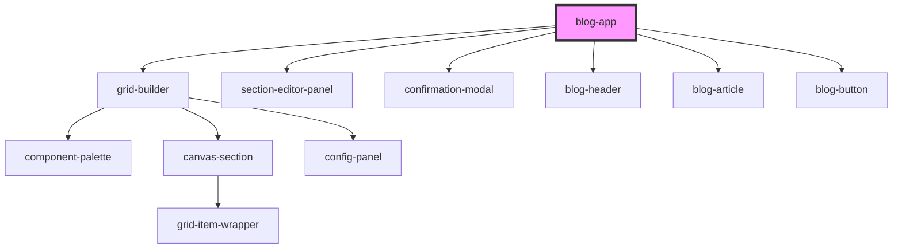

# blog-app

<!-- Auto Generated Below -->

## Dependencies

### Depends on

- [grid-builder](../../../components/grid-builder)
- [section-editor-panel](../section-editor-panel)
- [confirmation-modal](../confirmation-modal)
- [blog-header](../blog-header)
- [blog-article](../blog-article)
- [blog-button](../blog-button)

### Graph

----------------------------------------------

*Built with [StencilJS](https://stenciljs.com/)*
