# blog-app

<!-- Auto Generated Below -->

## Dependencies

### Depends on

- [component-palette](../../../components/component-palette)
- [layer-panel](../layer-panel)
- [grid-viewer](../../../components/grid-viewer)
- [grid-builder](../../../components/grid-builder)
- [canvas-header](../canvas-header)
- [section-editor-panel](../section-editor-panel)
- [confirmation-modal](../confirmation-modal)
- [custom-config-panel](../custom-config-panel)
- [custom-palette-item](../custom-palette-item)
- [blog-header-drag-clone](../blog-header-drag-clone)
- [blog-header](../blog-header)
- [blog-article-drag-clone](../blog-article-drag-clone)
- [blog-article](../blog-article)
- [blog-image-drag-clone](../blog-image-drag-clone)
- [blog-image](../blog-image)
- [blog-button-drag-clone](../blog-button-drag-clone)
- [blog-button](../blog-button)
- [image-gallery-drag-clone](../image-gallery-drag-clone)
- [image-gallery](../image-gallery)
- [dashboard-widget-drag-clone](../dashboard-widget-drag-clone)
- [dashboard-widget](../dashboard-widget)
- [live-data-drag-clone](../live-data-drag-clone)
- [live-data](../live-data)

### Graph

```mermaid
graph TD;
  blog-app --> component-palette
  blog-app --> layer-panel
  blog-app --> grid-viewer
  blog-app --> grid-builder
  blog-app --> canvas-header
  blog-app --> section-editor-panel
  blog-app --> confirmation-modal
  blog-app --> custom-config-panel
  blog-app --> custom-palette-item
  blog-app --> blog-header-drag-clone
  blog-app --> blog-header
  blog-app --> blog-article-drag-clone
  blog-app --> blog-article
  blog-app --> blog-image-drag-clone
  blog-app --> blog-image
  blog-app --> blog-button-drag-clone
  blog-app --> blog-button
  blog-app --> image-gallery-drag-clone
  blog-app --> image-gallery
  blog-app --> dashboard-widget-drag-clone
  blog-app --> dashboard-widget
  blog-app --> live-data-drag-clone
  blog-app --> live-data
  layer-panel --> layer-panel-folder-header
  layer-panel --> layer-panel-item
  grid-viewer --> canvas-section-viewer
  canvas-section-viewer --> error-boundary
  canvas-section-viewer --> grid-item-wrapper
  grid-item-wrapper --> error-boundary
  grid-builder --> canvas-section
  canvas-section --> error-boundary
  canvas-section --> grid-item-wrapper
  custom-config-panel --> custom-palette-item
  custom-config-panel --> blog-header-drag-clone
  custom-config-panel --> blog-header
  custom-config-panel --> blog-article-drag-clone
  custom-config-panel --> blog-article
  custom-config-panel --> blog-image-drag-clone
  custom-config-panel --> blog-image
  custom-config-panel --> blog-button-drag-clone
  custom-config-panel --> blog-button
  custom-config-panel --> image-gallery-drag-clone
  custom-config-panel --> image-gallery
  custom-config-panel --> dashboard-widget-drag-clone
  custom-config-panel --> dashboard-widget
  custom-config-panel --> live-data-drag-clone
  custom-config-panel --> live-data
  style blog-app fill:#f9f,stroke:#333,stroke-width:4px
```

----------------------------------------------

*Built with [StencilJS](https://stenciljs.com/)*
