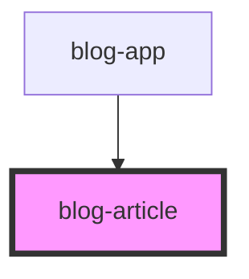

# blog-article

<!-- Auto Generated Below -->

## Properties

| Property  | Attribute | Description | Type     | Default                       |
| --------- | --------- | ----------- | -------- | ----------------------------- |
| `author`  | `author`  |             | `string` | `undefined`                   |
| `content` | `content` |             | `string` | `'Article content goes here'` |
| `date`    | `date`    |             | `string` | `undefined`                   |

## Dependencies

### Used by

 - [blog-app](../blog-app)

### Graph

----------------------------------------------

*Built with [StencilJS](https://stenciljs.com/)*
