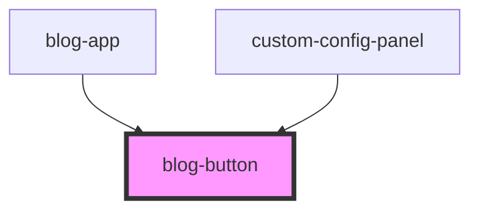

# blog-button

<!-- Auto Generated Below -->

## Properties

| Property  | Attribute | Description | Type                       | Default       |
| --------- | --------- | ----------- | -------------------------- | ------------- |
| `href`    | `href`    |             | `string`                   | `undefined`   |
| `label`   | `label`   |             | `string`                   | `'Click me!'` |
| `variant` | `variant` |             | `"primary" \| "secondary"` | `'primary'`   |

## Events

| Event         | Description | Type                |
| ------------- | ----------- | ------------------- |
| `buttonClick` |             | `CustomEvent<void>` |

## Dependencies

### Used by

 - [blog-app](../blog-app)
 - [custom-config-panel](../custom-config-panel)

### Graph

----------------------------------------------

*Built with [StencilJS](https://stenciljs.com/)*
