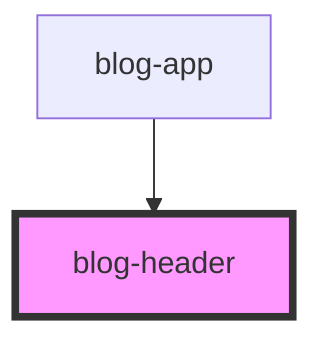

# blog-header

<!-- Auto Generated Below -->

## Properties

| Property      | Attribute      | Description | Type     | Default            |
| ------------- | -------------- | ----------- | -------- | ------------------ |
| `headerTitle` | `header-title` |             | `string` | `'Default Header'` |
| `subtitle`    | `subtitle`     |             | `string` | `undefined`        |

## Dependencies

### Used by

 - [blog-app](../blog-app)

### Graph

----------------------------------------------

*Built with [StencilJS](https://stenciljs.com/)*
