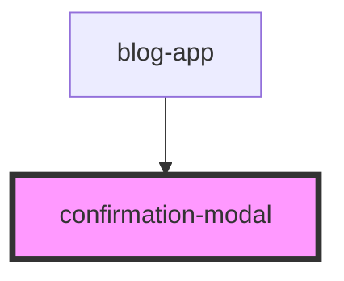

# confirmation-modal


<!-- Auto Generated Below -->


## Overview

Confirmation Modal Component
=============================

Demo Component - NOT Part of Library

This component demonstrates how to implement the grid-builder library's
deletion hook system with a custom confirmation modal.

Library Feature Being Demonstrated:
-----------------------------------
This modal is used with the library's **onBeforeDelete hook** system.

How It Works:
-------------
1. Library calls onBeforeDelete hook when user deletes component
2. Hook returns a Promise that doesn't resolve immediately
3. Host app shows this modal (or any modal library)
4. User clicks "Delete" or "Cancel"
5. Modal fires confirm/cancel event
6. Host app resolves Promise with true/false
7. Library proceeds with or cancels deletion

Code Flow Example:
------------------
```typescript
// In parent component (blog-app.tsx):
private handleBeforeDelete = (context: DeletionHookContext): Promise<boolean> => {
  return new Promise((resolve) => {
    this.deleteResolve = resolve;
    this.isConfirmModalOpen = true;  // Show this modal
  });
};

private handleConfirmDelete = () => {
  this.deleteResolve(true);   // Tell library to proceed
};

private handleCancelDelete = () => {
  this.deleteResolve(false);  // Tell library to cancel
};
```

Why This Pattern:
-----------------
- **Library agnostic**: Library doesn't provide modal UI
- **Flexibility**: Use any modal library (Material, Bootstrap, Ant Design, etc.)
- **Customization**: Full control over modal appearance and behavior
- **Async support**: Can make API calls before resolving

Alternative Implementations:
---------------------------
You could replace this component with:
- Material Design modal
- Bootstrap modal
- Ant Design modal
- Native browser confirm() (not recommended)
- Custom modal from your design system

The library doesn't care what modal you use - it just waits for the
Promise to resolve with true/false.

## Properties

| Property | Attribute | Description                                                                    | Type                    | Default |
| -------- | --------- | ------------------------------------------------------------------------------ | ----------------------- | ------- |
| `data`   | --        | Modal content (title and message) Passed from parent when showing confirmation | `ConfirmationModalData` | `null`  |
| `isOpen` | `is-open` | Modal open/closed state Controlled by parent component (blog-app)              | `boolean`               | `false` |


## Events

| Event     | Description                                                                       | Type                |
| --------- | --------------------------------------------------------------------------------- | ------------------- |
| `cancel`  | Event: User cancelled deletion Parent resolves deletion hook Promise with `false` | `CustomEvent<void>` |
| `confirm` | Event: User confirmed deletion Parent resolves deletion hook Promise with `true`  | `CustomEvent<void>` |


## Dependencies

### Used by

 - [blog-app](../blog-app)

### Graph


----------------------------------------------

*Built with [StencilJS](https://stenciljs.com/)*
