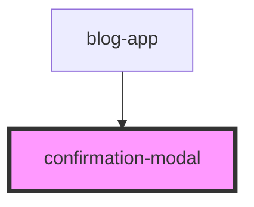

# confirmation-modal

<!-- Auto Generated Below -->

## Properties

| Property | Attribute | Description | Type                    | Default |
| -------- | --------- | ----------- | ----------------------- | ------- |
| `data`   | --        |             | `ConfirmationModalData` | `null`  |
| `isOpen` | `is-open` |             | `boolean`               | `false` |

## Events

| Event     | Description | Type                |
| --------- | ----------- | ------------------- |
| `cancel`  |             | `CustomEvent<void>` |
| `confirm` |             | `CustomEvent<void>` |

## Dependencies

### Used by

 - [blog-app](../blog-app)

### Graph

----------------------------------------------

*Built with [StencilJS](https://stenciljs.com/)*
