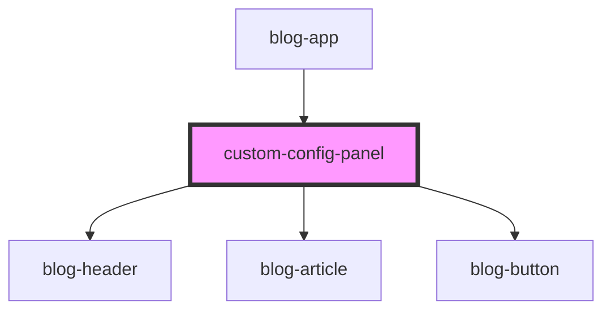

# custom-config-panel

<!-- Auto Generated Below -->

## Properties

| Property | Attribute | Description                                                                                                                                                                                                                                           | Type             | Default     |
| -------- | --------- | ----------------------------------------------------------------------------------------------------------------------------------------------------------------------------------------------------------------------------------------------------- | ---------------- | ----------- |
| `api`    | --        | Grid Builder API (accessed from window.gridBuilderAPI or passed as prop)  **Source**: window.gridBuilderAPI (set by grid-builder component) **Purpose**: Access grid state and methods **Required**: Component won't work without valid API reference | `GridBuilderAPI` | `undefined` |

## Dependencies

### Used by

 - [blog-app](../blog-app)

### Depends on

- [blog-header](../blog-header)
- [blog-article](../blog-article)
- [blog-button](../blog-button)

### Graph

----------------------------------------------

*Built with [StencilJS](https://stenciljs.com/)*
