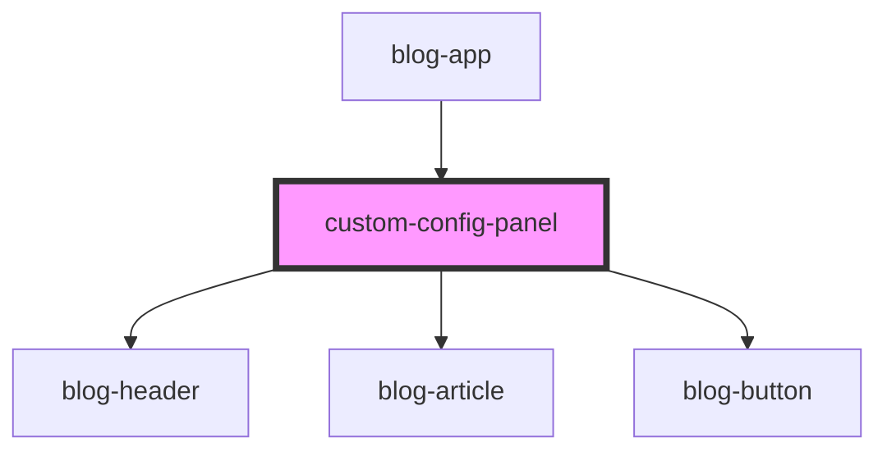

# custom-config-panel

<!-- Auto Generated Below -->

## Dependencies

### Used by

 - [blog-app](../blog-app)

### Depends on

- [blog-header](../blog-header)
- [blog-article](../blog-article)
- [blog-button](../blog-button)

### Graph

----------------------------------------------

*Built with [StencilJS](https://stenciljs.com/)*
