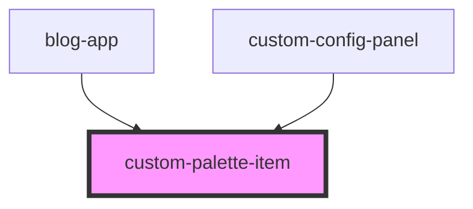

# custom-palette-item

<!-- Auto Generated Below -->

## Overview

Custom Palette Item Component
==============================

Example custom palette item that shows how consumers can create
fully customized palette entries for their components.

Updated to display SVG icons on top with titles below (similar to UI builder pattern)

## Properties

| Property                     | Attribute        | Description                  | Type     | Default     |
| ---------------------------- | ---------------- | ---------------------------- | -------- | ----------- |
| `componentType` _(required)_ | `component-type` | Component type               | `string` | `undefined` |
| `icon` _(required)_          | `icon`           | Icon/emoji or SVG identifier | `string` | `undefined` |
| `name` _(required)_          | `name`           | Display name                 | `string` | `undefined` |

## Dependencies

### Used by

 - [blog-app](../blog-app)
 - [custom-config-panel](../custom-config-panel)

### Graph

----------------------------------------------

*Built with [StencilJS](https://stenciljs.com/)*
