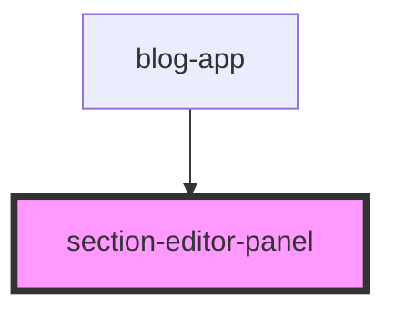

# section-editor-panel

<!-- Auto Generated Below -->

## Overview

Section Editor Panel Component
===============================

Demo Component - NOT Part of Library

This component demonstrates how to build custom UI for editing canvas metadata
in applications using the grid-builder library.

Purpose:
--------
Shows how to create a side panel for editing section/canvas settings.
This is completely custom to your application - the library doesn't provide this.

Library Relationship:
---------------------
- Library owns: Component placement, layouts, zIndex (grid state)
- Host app owns: Canvas metadata (titles, colors, settings) - THIS COMPONENT
- Metadata flows: App → Library via canvasMetadata prop

Pattern Demonstrated:
---------------------
1. User clicks section header (demo UI)
2. App opens this panel (demo component)
3. User edits title/color
4. App updates canvasMetadata state
5. Library receives updated metadata via prop
6. Library passes backgroundColor to canvas-section

Why This Approach:
------------------
- Library stays focused on grid logic
- Host app controls all presentation/metadata UI
- You can use any UI framework (Material, Bootstrap, etc.)
- Complete flexibility over settings panel design

## Properties

| Property      | Attribute | Description                                                                  | Type                | Default |
| ------------- | --------- | ---------------------------------------------------------------------------- | ------------------- | ------- |
| `isOpen`      | `is-open` | Panel open/closed state Controlled by parent component (blog-app)            | `boolean`           | `false` |
| `sectionData` | --        | Section data being edited Passed from parent when user clicks section header | `SectionEditorData` | `null`  |

## Events

| Event                | Description                                                                                                                  | Type                                                                         |
| -------------------- | ---------------------------------------------------------------------------------------------------------------------------- | ---------------------------------------------------------------------------- |
| `closePanel`         | Event: Close panel Fired when user clicks Cancel, Save, or overlay                                                           | `CustomEvent<void>`                                                          |
| `deleteSection`      | Event: Delete section Fired when user clicks Delete button Parent handles canvas removal                                     | `CustomEvent<{ canvasId: string; }>`                                         |
| `previewColorChange` | Event: Preview color change Fired when user changes color picker (live preview) Parent temporarily updates canvas background | `CustomEvent<{ canvasId: string; backgroundColor: string; }>`                |
| `previewTitleChange` | Event: Preview title change Fired when user types in title input (live preview) Parent temporarily updates canvas title      | `CustomEvent<{ canvasId: string; title: string; }>`                          |
| `updateSection`      | Event: Update section Fired when user clicks Save with edited values Parent updates canvasMetadata state in response         | `CustomEvent<{ canvasId: string; title: string; backgroundColor: string; }>` |

## Dependencies

### Used by

 - [blog-app](../blog-app)

### Graph

----------------------------------------------

*Built with [StencilJS](https://stenciljs.com/)*
