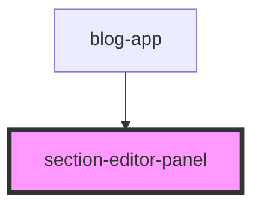

# section-editor-panel

<!-- Auto Generated Below -->

## Properties

| Property      | Attribute | Description | Type                | Default |
| ------------- | --------- | ----------- | ------------------- | ------- |
| `isOpen`      | `is-open` |             | `boolean`           | `false` |
| `sectionData` | --        |             | `SectionEditorData` | `null`  |

## Events

| Event           | Description | Type                                                                         |
| --------------- | ----------- | ---------------------------------------------------------------------------- |
| `closePanel`    |             | `CustomEvent<void>`                                                          |
| `updateSection` |             | `CustomEvent<{ canvasId: string; title: string; backgroundColor: string; }>` |

## Dependencies

### Used by

 - [blog-app](../blog-app)

### Graph

----------------------------------------------

*Built with [StencilJS](https://stenciljs.com/)*
