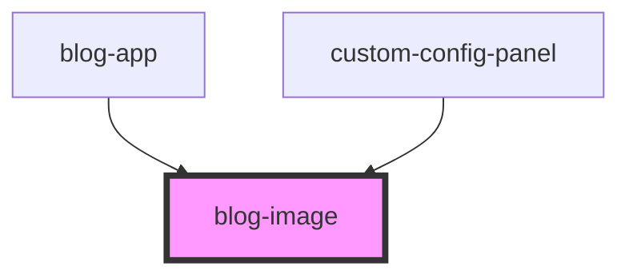

# blog-image

<!-- Auto Generated Below -->

## Properties

| Property    | Attribute    | Description | Type                   | Default                                                                               |
| ----------- | ------------ | ----------- | ---------------------- | ------------------------------------------------------------------------------------- |
| `alt`       | `alt`        |             | `string`               | `'Placeholder image'`                                                                 |
| `caption`   | `caption`    |             | `string`               | `undefined`                                                                           |
| `objectFit` | `object-fit` |             | `"contain" \| "cover"` | `'contain'`                                                                           |
| `src`       | `src`        |             | `string`               | `'https://images.unsplash.com/photo-1506905925346-21bda4d32df4?w=800&h=600&fit=crop'` |

## Dependencies

### Used by

 - [blog-app](../blog-app)
 - [custom-config-panel](../custom-config-panel)

### Graph

----------------------------------------------

*Built with [StencilJS](https://stenciljs.com/)*
