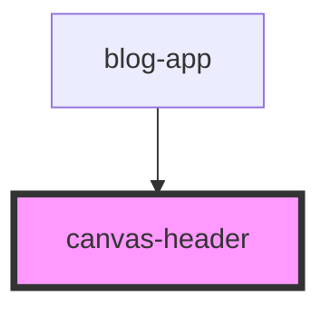

# canvas-header

<!-- Auto Generated Below -->

## Overview

CanvasHeader Component
======================

Declarative header component for canvas sections.

**Tag**: `<canvas-header>`
**Shadow DOM**: Disabled (matches blog-app styling)

## Properties

| Property                    | Attribute       | Description                                                                                                                                                                          | Type      | Default     |
| --------------------------- | --------------- | ------------------------------------------------------------------------------------------------------------------------------------------------------------------------------------ | --------- | ----------- |
| `canvasId` _(required)_     | `canvas-id`     | Canvas ID for data tracking  **Purpose**: Identify which canvas this header belongs to **Required**: Yes                                                                             | `string`  | `undefined` |
| `isActive`                  | `is-active`     | Whether this canvas is currently active  **Purpose**: Control header opacity (active = full opacity, inactive = dimmed) **Default**: false                                           | `boolean` | `false`     |
| `isDeletable`               | `is-deletable`  | Whether this section can be deleted  **Purpose**: Control delete button visibility **Default**: true **Note**: Default sections (hero, articles, footer) should set to false         | `boolean` | `true`      |
| `sectionTitle` _(required)_ | `section-title` | Display title for the canvas section  **Purpose**: Text shown in the title badge **Required**: Yes **Note**: Named sectionTitle to avoid conflict with standard HTML title attribute | `string`  | `undefined` |

## Events

| Event         | Description                                                                                                                        | Type                                 |
| ------------- | ---------------------------------------------------------------------------------------------------------------------------------- | ------------------------------------ |
| `deleteClick` | Event emitted when delete button is clicked  **Detail**: { canvasId: string } **Use case**: Delete the canvas section              | `CustomEvent<{ canvasId: string; }>` |
| `headerClick` | Event emitted when header title is clicked  **Detail**: { canvasId: string } **Use case**: Activate canvas and open section editor | `CustomEvent<{ canvasId: string; }>` |

## Dependencies

### Used by

 - [blog-app](../blog-app)

### Graph

----------------------------------------------

*Built with [StencilJS](https://stenciljs.com/)*
