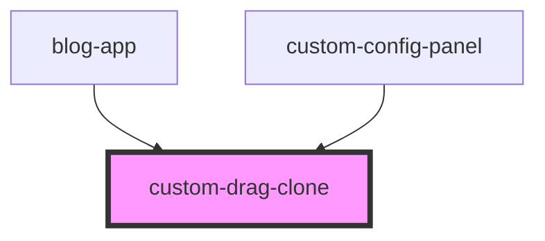

# custom-drag-clone

<!-- Auto Generated Below -->

## Overview

Custom Drag Clone Component
============================

Custom drag clone that shows a visual preview of the component being dragged.
Each component type has a unique appearance that matches what will be placed
on the canvas, helping with visual alignment and user understanding.

The component fills the exact width and height provided, scaled to match
the actual drop size.

## Properties

| Property                     | Attribute        | Description                  | Type     | Default     |
| ---------------------------- | ---------------- | ---------------------------- | -------- | ----------- |
| `componentType` _(required)_ | `component-type` | Component type being dragged | `string` | `undefined` |
| `height` _(required)_        | `height`         | Height in pixels             | `number` | `undefined` |
| `icon` _(required)_          | `icon`           | Icon/emoji                   | `string` | `undefined` |
| `name` _(required)_          | `name`           | Display name                 | `string` | `undefined` |
| `width` _(required)_         | `width`          | Width in pixels              | `number` | `undefined` |

## Dependencies

### Used by

 - [blog-app](../blog-app)
 - [custom-config-panel](../custom-config-panel)

### Graph

----------------------------------------------

*Built with [StencilJS](https://stenciljs.com/)*
