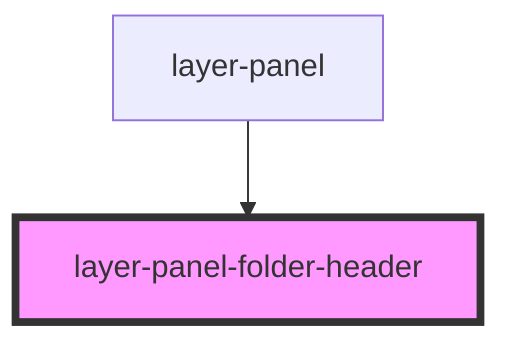

# layer-panel-folder-header

<!-- Auto Generated Below -->

## Properties

| Property                   | Attribute          | Description                                                                               | Type      | Default     |
| -------------------------- | ------------------ | ----------------------------------------------------------------------------------------- | --------- | ----------- |
| `canvasId` _(required)_    | `canvas-id`        | Canvas ID this folder represents                                                          | `string`  | `undefined` |
| `canvasTitle` _(required)_ | `canvas-title`     | Display title for the canvas                                                              | `string`  | `undefined` |
| `isActive`                 | `is-active`        | Whether this canvas is the active canvas                                                  | `boolean` | `false`     |
| `isEmpty`                  | `is-empty`         | Whether this folder has no items matching current search When true, folder appears dimmed | `boolean` | `false`     |
| `isExpanded`               | `is-expanded`      | Whether this folder is currently expanded                                                 | `boolean` | `true`      |
| `itemCount` _(required)_   | `item-count`       | Number of items in this canvas                                                            | `number`  | `undefined` |
| `totalItemCount`           | `total-item-count` | Total item count (for showing "0 / 15" during search)                                     | `number`  | `undefined` |

## Events

| Event            | Description                                                                  | Type                                 |
| ---------------- | ---------------------------------------------------------------------------- | ------------------------------------ |
| `activateCanvas` | Emitted when user clicks the folder header to activate canvas                | `CustomEvent<{ canvasId: string; }>` |
| `scrollToCanvas` | Emitted when user double-clicks the folder header to scroll canvas into view | `CustomEvent<{ canvasId: string; }>` |
| `toggleFolder`   | Emitted when user clicks the expand/collapse toggle                          | `CustomEvent<{ canvasId: string; }>` |

## Dependencies

### Used by

 - [layer-panel](../layer-panel)

### Graph

----------------------------------------------

*Built with [StencilJS](https://stenciljs.com/)*
