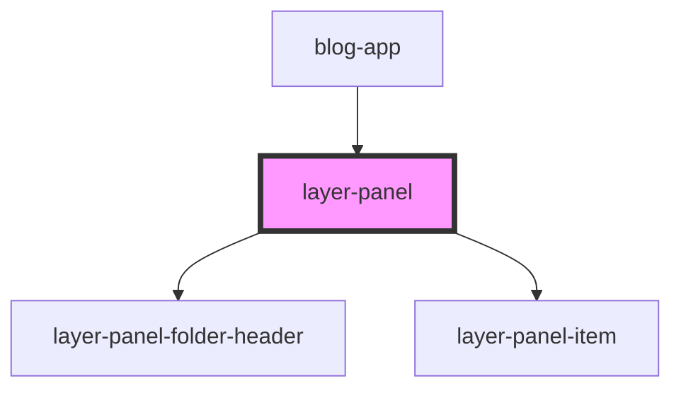

# layer-panel

<!-- Auto Generated Below -->

## Properties

| Property            | Attribute             | Description                                                                                                                                                                                                                                                                                                                                                                             | Type                                   | Default     |
| ------------------- | --------------------- | --------------------------------------------------------------------------------------------------------------------------------------------------------------------------------------------------------------------------------------------------------------------------------------------------------------------------------------------------------------------------------------- | -------------------------------------- | ----------- |
| `api`               | `api`                 | Grid Builder API instance (instance-based architecture)  **Required**: Must be provided or component won't display items **Source**: Host app (blog-app) passes this via prop **Purpose**: Access instance-based state for multi-instance support  **Why needed**: Grid-builder uses its own state instance. The layer panel must access that same instance to display items correctly. | `any`                                  | `undefined` |
| `canvasMetadata`    | --                    | Canvas metadata for folder titles Map of canvasId → { title: string }                                                                                                                                                                                                                                                                                                                   | `{ [x: string]: { title: string; }; }` | `{}`        |
| `folderHeight`      | `folder-height`       | Height of folder header in pixels                                                                                                                                                                                                                                                                                                                                                       | `number`                               | `40`        |
| `itemHeight`        | `item-height`         | Height of layer item in pixels                                                                                                                                                                                                                                                                                                                                                          | `number`                               | `40`        |
| `searchDebounceMs`  | `search-debounce-ms`  | Search input debounce delay in milliseconds                                                                                                                                                                                                                                                                                                                                             | `number`                               | `300`       |
| `virtualBufferPx`   | `virtual-buffer-px`   | Pre-render buffer in pixels (renders items outside viewport)                                                                                                                                                                                                                                                                                                                            | `number`                               | `200`       |
| `virtualWindowSize` | `virtual-window-size` | Number of items to render in virtual window                                                                                                                                                                                                                                                                                                                                             | `number`                               | `50`        |

## Dependencies

### Used by

 - [blog-app](../blog-app)

### Depends on

- [layer-panel-folder-header](../layer-panel-folder-header)
- [layer-panel-item](../layer-panel-item)

### Graph

----------------------------------------------

*Built with [StencilJS](https://stenciljs.com/)*
